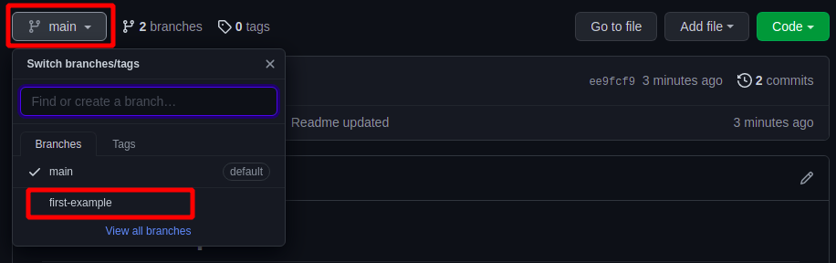

# react-examples

This repository contains the source code and other extra materials like slides related to react.

## How to use

The code snapshots are organized in multiple **branches** where every branch **represents a react example section**.

For example, the branch [first-example](https://github.com/Bipulkumarsingh/react-examples/tree/first-example) holds all code snapshots and extra materials for basic starter example of the react.

You can switch branches via the branch dropdown above the directory explorer.

In most branches, you'll find multiple folders which organize the section-specific content further:

- Often, you'll find a `/code` subfolder which contains any relevent code snapshots for the given course section
- You also often find `/slides` folders which - guess what - contain the slides for the module
- `/extra-files` typically contains extra files like `.css` files that might be attached to individual lectures in that course module

The folder names should generally be self-explanatory but also feel free to simply click around and see which materials are available.

### Downloading code snapshots

You can download all the content of a branch via the "Code" button here on Github. You can then either [clone](https://docs.github.com/en/github/creating-cloning-and-archiving-repositories/cloning-a-repository) the repository or simply download the selected branch content as a ZIP file.

**Important:** You always download the **entire branch content!**

You can then dive into the interesting folders (e.g. the individual code snapshots) locally on your hard drive.

### Running the attached code

You can use the attached code simply to compare it to yours. But you can also run it.

To run my code, navigate into a specific code snapshot folder via the `cd` command in your command prompt or terminal first.

Then run `npm install` to install all required dependencies (this will create a `/node_modules` folder).